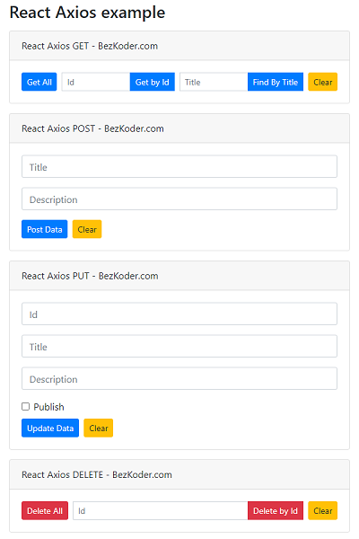

# React Axios example with Rest API

React Client with Axios to make CRUD requests to Rest API in that:

- React Axios GET request: get all Tutorials, get Tutorial by Id, find Tutorial by title
- React Axios POST request: create new Tutorial
- React Axios PUT request: update an existing Tutorial
- React Axios DELETE request: delete a Tutorial, delete all Tutorials

This project was bootstrapped with [Create React App](https://github.com/facebook/create-react-app).
