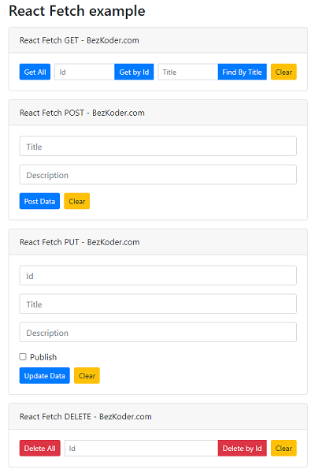

# React Fetch example with Rest API

React Client with Fetch API to make CRUD requests to Rest API in that:
- React Fetch GET request: get all Tutorials, get Tutorial by Id, find Tutorial by title
- React Fetch POST request: create new Tutorial
- React Fetch PUT request: update an existing Tutorial
- React Fetch DELETE request: delete a Tutorial, delete all Tutorials

This project was bootstrapped with [Create React App](https://github.com/facebook/create-react-app).