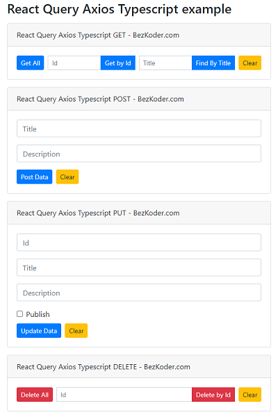

# React Query with Axios and Typescript example

React Client with React Query and Axios (Typescript) to make CRUD requests to Rest API in that:

- React Query Axios Typescript GET request: get all Tutorials, get Tutorial by Id, find Tutorial by title
- React Query Axios Typescript POST request: create new Tutorial
- React Query Axios Typescript PUT request: update an existing Tutorial
- React Query Axios Typescript DELETE request: delete a Tutorial, delete all Tutorials

This project was bootstrapped with [Create React App](https://github.com/facebook/create-react-app).